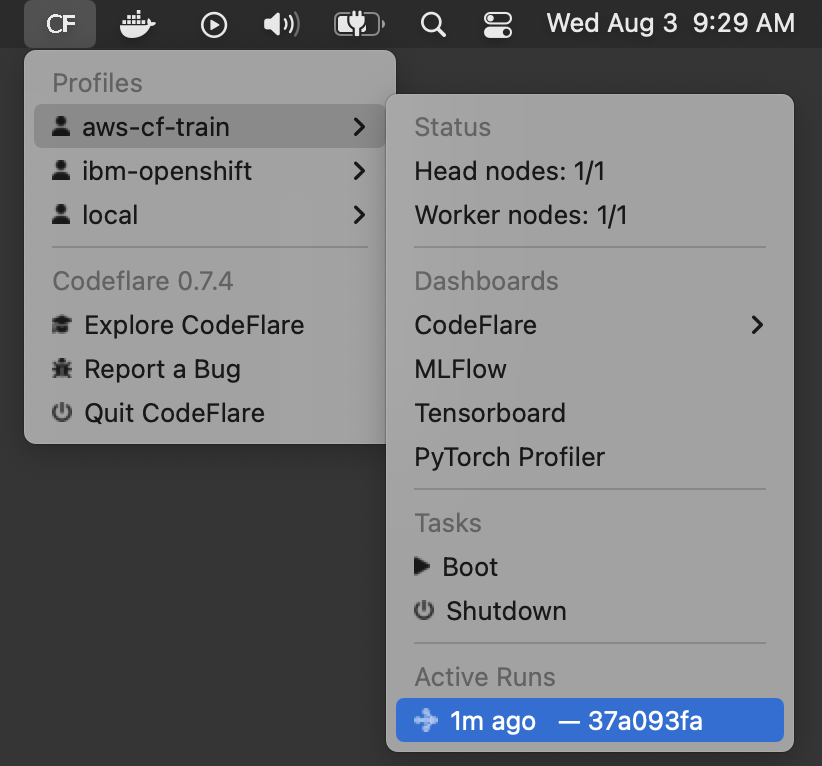

# CodeFlare Desktop Client

[CodeFlare](https://codeflare.dev) is a framework to simplify the
integration, scaling and acceleration of complex multi-step analytics
and machine learning pipelines on the cloud.

This repository is home to the open source CodeFlare CLI,
`codeflare`. On macOS, you can [get started
immediately](#installation) using `brew install`.

| **Rapid Job Submission**                                                                                             | **Optimized Inner Loop**                                                                                                                                                          | **Easy access to Pop-up Dashboards**                                                                                                   |
| -------------------------------------------------------------------------------------------------------------------- | --------------------------------------------------------------------------------------------------------------------------------------------------------------------------------- | -------------------------------------------------------------------------------------------------------------------------------------- |
| `codeflare` guides you via a series of questions. Where is your code? Where is your data? How many GPUs do you need? | You may name the set of answers you provided. We call this a **profile**. Your inner loop then becomes: `codeflare -y -p <profileName>`. The `-y` means accept all prior answers. | `codeflare` offers quick access to MLFlow, Tensorboard, and a custom dashboard that tracks the resource consumption and logs of a job. |
| `codeflare` glues answers together and submits a Kubernetes job.                                                     | You can switch quickly between profiles, and even submit jobs to distinct profiles concurrently.                                                                                  | There is no need to fiddle with yaml files and port forwards. With a few clicks, you will get a popup dashboard window.                |

## macOS Tray Menu

If you are on macOS, you can leverage the menu that `codeflare` places
in the upper right of your menubar (commonly known as a "tray"
menu). From your terminal, try `codeflare hello`, and you should see a
`CF` tray menu.

## Installation

On macOS, if you have [HomeBrew](https://brew.sh/) installed:

    brew tap project-codeflare/codeflare-cli https://github.com/project-codeflare/codeflare-cli
    brew install codeflare

Otherwise, visit our
[Releases](https://github.com/project-codeflare/codeflare-cli/releases/latest)
page to download the zip file for your platform. Unzip and place the
enclosed `bin/` directory on your `PATH`.

## Command Line Options

- `-y/--yes`: Repeat a prior run using all of the same answers, without any prompts.
- `-p/--profile`: Use a named profile. By default, your choices will be stored in a profile named "default".
- `-t/--team`: We have support for specializing the CLI towards specific clusters. Contact your admin for a preferred team name.
- `-V`: this will provide verbose output of the tool's operation.

## Contributing

Want to help out? Check out the [developer guide](./docs/development/README.md).
