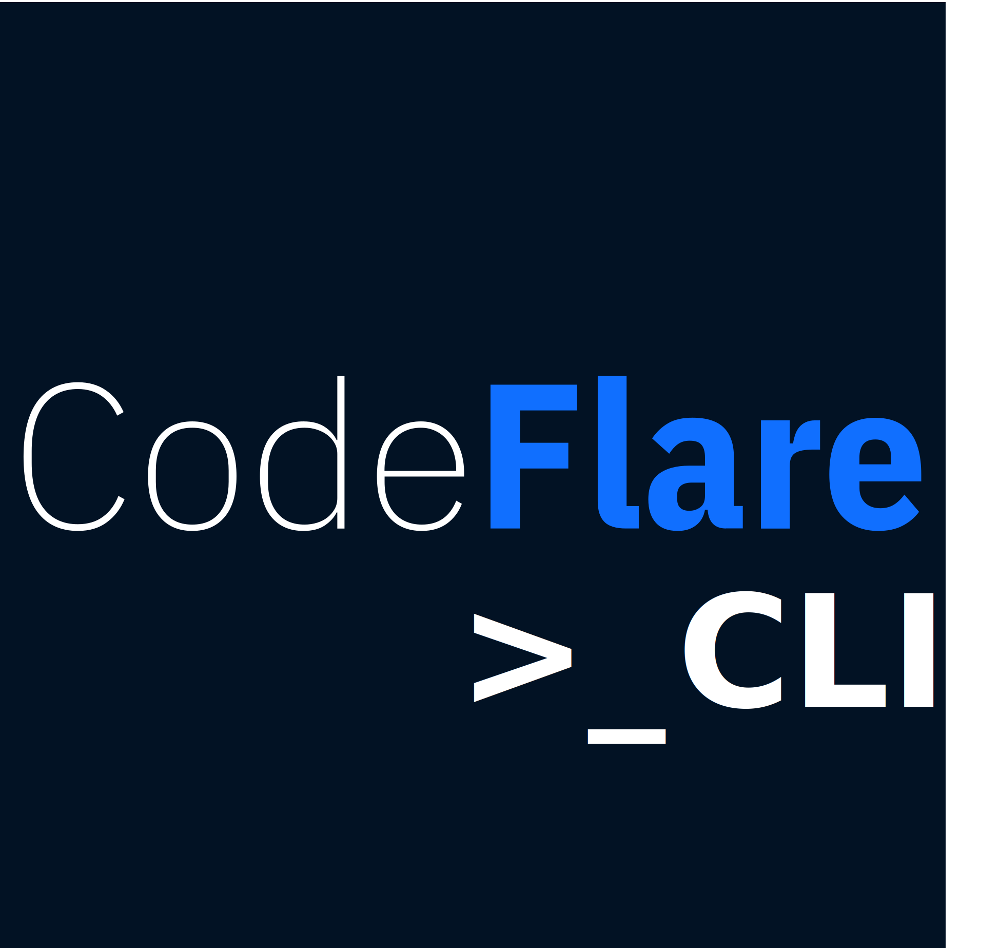

# The CodeFlare CLI

  

[CodeFlare](https://codeflare.dev) is a framework to simplify the
integration, scaling and acceleration of complex multi-step analytics
and machine learning pipelines on the cloud.

This repository is home to the open source CodeFlare CLI,
`codeflare`. This CLI helps you to submit and observe jobs in a
Kubernetes cluster.

[Check out some use cases in motion](./docs/scenarios/README.md#readme).

## Installation

Please visit the
[Releases](https://github.com/project-codeflare/codeflare-cli/releases/latest)
page to download the package for your platform, unpack it, and place
the enclosed `bin/` directory on your `PATH`. macOS users may use
[HomeBrew](https://brew.sh/) to expedite installation:

    brew tap project-codeflare/codeflare-cli https://github.com/project-codeflare/codeflare-cli
    brew install codeflare

## How `codeflare` Works

The `codeflare` CLI is programmed to know how to **guide** you through
a collection of tasks. For example, you can use `codeflare` to submit
a Ray job to a Kubernetes cluster, or to observe a running job. It
guides you by asking you questions, and it tries to formulate each
question as a choice from a list of possibilities. In this example, it
attempts to list your available Kubernetes clusters, and you need only
select from that list. It does the same kind of thing for S3 data, and
for the resource requirements of your job.

### Managing Profiles

The `codeflare` CLI remembers your answers to these questions in a
"profile". This allows you to easily re-run a task using the same
answers as before: `codeflare -y/--yes`, which auto-accepts your prior
answers, as long as those answers are still valid. To run with a
profile name of your choosing, use the `-p/--profile` command line
option. In doing so, you may thus quickly switch between variants,
e.g. different input data, or different Kubernetes clusters.

To manage your profiles, use the `codeflare profile
list/get/delete/clone` command lines.

## Command Line Options

- `-y/--yes`: Repeat a prior run using all of the same answers, without any prompts.
- `-p/--profile`: Use a named profile. By default, your choices will be stored in a profile named "default".
- `-V`: this will provide verbose output of the tool's operation.

## Contributing

Want to help out? Check out the [developer guide](./docs/development/README.md).
